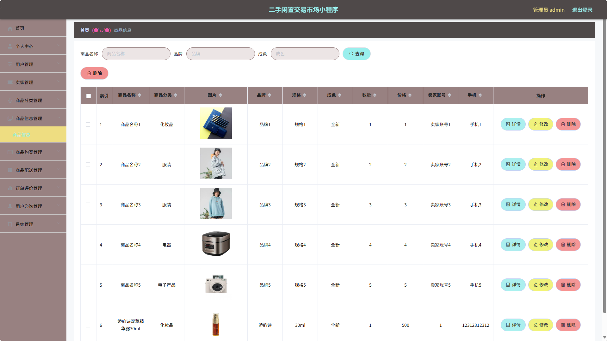

# 二手闲置交易市场小程序(文末免费领取☟)
> 
#### 介绍
二手闲置交易市场小程序(Java_SSM_微信小程序)
有BUG可留言加微

#### 软件架构
Java + SSM + 微信小程序 + Mybatis + Mysql

#### 项目功能说明

> + 系统分为管理员、卖家、用户三种角色
> + 登录注册
> + 管理员管理、卖家管理、用户角色管理
> + 商品分类管理
> + 商品信息管理
> + 商品购买管理
> + 商品配送管理
> + 订单评价管理
> + 用户咨询管理
> + 系统管理：系统公告、在线客服、轮播图管理

### 部分功能演示

### 环境需求(可免费提供)
- idea/eclipse、jdk-1.8、maven-3.8.6、mysql、node.js等

## 有项目修改、安装调试需求 请联系以下

## 获取资源扫☝☝☝

